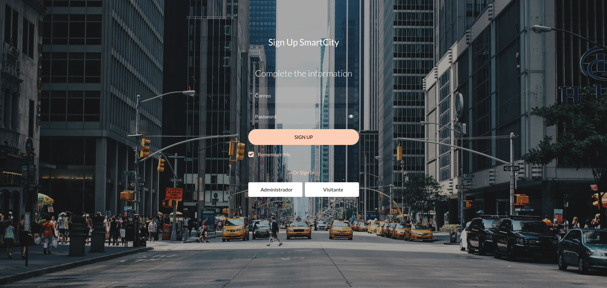

# Sistema de Control y monitoreo de Tránsito SmartTraffic-Cloud

## Presentación al problema

En las grandes ciudades, la gestión del tráfico vehicular representa un desafío crítico debido al constante aumento del parque automotor y a la falta de infraestructura adaptable. Las intersecciones suelen ser puntos de congestión, donde el flujo vehicular ineficiente genera largos tiempos de espera, mayor consumo de combustible y un impacto negativo en el medio ambiente. Además, la falta de sistemas en tiempo real para monitorear y reaccionar ante accidentes o eventos imprevistos dificulta una respuesta rápida y eficaz, lo que agrava los problemas de movilidad. En este contexto, surge la necesidad de implementar un sistema inteligente que permita analizar y gestionar dinámicamente las condiciones del tráfico, optimizando el uso de los semáforos y mejorando significativamente la experiencia de los conductores.

## Descripción de la solución propuesta

La solución propuesta consiste en desarrollar un sistema de control de tráfico inteligente denominado SmartTraffic-Cloud(**Página Web**), diseñado para optimizar el flujo vehicular en una intersección. Este sistema emplea sensores ultrasónicos para detectar en tiempo real la densidad del tráfico y microcontroladores ESP32 como nodos de procesamiento local, los cuales transmiten los datos a la nube para su análisis avanzado mediante servicios de AWS. La solución incluye una aplicación web que permite a los administradores monitorear el estado de los semáforos y realizar ajustes remotos en tiempo real, así como visualizar estadísticas del tráfico. Con este enfoque, se busca reducir los tiempos de espera, mejorar la fluidez del tránsito y proporcionar una herramienta eficiente y accesible para la gestión del tráfico vehicular.

